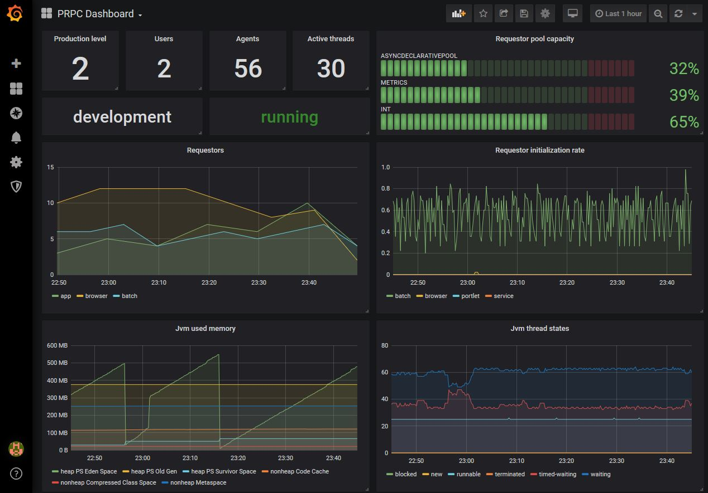

# micrometer-prpc [](https://travis-ci.com/D1le/micrometer-prpc)
Pega PRPC + Micrometer = :heart:

Expose your business and technical metrics from Pega to any monitoring system.

This small library aims to simplify usage of [Micrometer](https://micrometer.io) for collecting metrics in 
[Pega PRPC](https://www.pega.com/products/pega-platform) environment. Developers can use familiar concept of 'rules'
to implement metric value sources.



|PRPC version|     tested       |
|:----------:|:----------------:|
|   7.3.0    |:heavy_check_mark:|
|   8.2.1    |:heavy_check_mark:|

Java 8+ required.

### Build
#### Prerequisites
In order to build the project locally, you have to satisfy dependency prerequisites.

This project does not include any dependencies or any proprietary code. 
It is intended to be used by authorized Pegasystems Inc clients in their Pega PRPC environments.

This library relies on some internal PRPC jars which usually could be found in 
`<pega-distributive>.zip/archives/pegadbinstall-classes.zip/lib`:

- prbootstrap
- prbootstrap-api
- prenginext
- pricu2jdk
- prprivate
- prpublic

The following command will help to install the required jars to a local maven repository:
```
./mvnw install:install-file -Dfile=<path-to-prpc-libs>/<lib>.jar -DgroupId=com.pega.prpc -DartifactId=<lib> -Dversion=<version.prpc> -Dpackaging=jar -Dversion.prpc=<version.prpc>
```

#### Package
After the required jars are installed you may use the following command to build project:
```
./mvnw package -Dversion.prpc=<version.prpc>
```

### Install
Deploy the following jars to the PRPC instance as usual (from UI or service):
- micrometer-core-\<version.micrometer>.jar
- micrometer-registry-\<registry>-\<version.micrometer>.jar - one or multiple registry libs and its dependencies 
- micrometer-prpc-\<version>.jar

### Use
Create sources:
```java
// Sql source
PrpcSource source = SqlSource.builder()
        .queryString("select FirstProperty as \"Tag(first)\", " +
                            "SecondProperty as \"Tag(second)\", " +
                            "ThirdProperty as \"Value(count)\" " +
                            "from {CLASS:Some-Data-Class}")
        .groupPropName("pxPages")
        .expirationDuration(2)
        .expirationTimeUnit(TimeUnit.MINUTES)
        .build();

// Data Page source
PrpcSource source = DataPageSource.builder()
        .ruleName("D_SomeDataPage")
        .accessGroupName("Some:AccessGroup")
        .resultsPropName("pxResults")
        .groupPropName("pxPages")
        .expirationDuration(5)
        .expirationTimeUnit(TimeUnit.MINUTES)
        .build();

// Activity source
PrpcSource source = ActivitySource.builder()
        .ruleName("SomeActivity")
        .ruleClass("Some-Class")
        .accessGroupName("Some:AccessGroup")
        .resultsPropName("pxResults")
        .groupPropName("pxPages")
        .expirationDuration(10)
        .expirationTimeUnit(TimeUnit.MINUTES)
        .build();
```

A source should construct the following clipboard structure:
```
TopLevelPage [Page]
    pxResults(1) [Page List]
        Tag(tag_name_1) tagValue1 [Value Group]
        Tag(tag_name_2) tagValue2
        Value(count_1) 10         [Value Group]
        Value(count_2) 15
    pxResults(2)
        Tag(tag_name_1) tagValue3
        Tag(tag_name_2) tagValue4
        Value(count_1) 7
        Value(count_2) 13
    ...
```

Register metrics:
```java
// Create registry
MeterRegistry registry = ...

// Gauge - register single metric
registry.gauge("metric.gauge.single", source, PrpcCallback.strong(source, "PropertyReference"));

// MultiGauge - register multiple metrics with unique tags
MultiGauge mg = MultiGauge.builder("metric.gauge.multi").register(registry);
Iterable<MultiGauge.Row<?>> rows = MultiMeter.rows(source, "PropertyReference");
mg.register(rows);

// Counter
registry.more().counter("metric.counter.single", Tags.empty(), source, PrpcCallback.strong(source, "PropertyReference"));
```

For more information about micrometer features visit micrometer [docs](https://micrometer.io/docs) page.

### [Prometheus](https://prometheus.io/) + [Grafana](https://grafana.com/) example
1. Deploy libs:
- [micrometer-prpc.jar](https://github.com/D1le/micrometer-prpc/releases/latest)
- [micrometer-core.jar](https://search.maven.org/search?q=g:io.micrometer%20AND%20a:micrometer-core%20AND%20v:1.1*%20&core=gav)
- [micrometer-registry-prometheus.jar](https://search.maven.org/search?q=g:io.micrometer%20AND%20a:micrometer-registry-prometheus%20AND%20v:1.1*)
- [simpleclient_common.jar](https://search.maven.org/search?q=g:io.prometheus%20AND%20a:simpleclient_common%20AND%20v:0.5.0)
- [simpleclient.jar](https://search.maven.org/search?q=g:io.prometheus%20AND%20a:simpleclient%20AND%20v:0.5.0)

2. Implement startup agent:
```java
// Initialize registry and store it
MeterRegistry registry = new PrometheusMeterRegistry(PrometheusConfig.DEFAULT);
RegistryHolder.getInstance().put("prometheus", registry);

// Create source from out-of-the-box data page - D_pzNodeInformation
PrpcSource source = DataPageSource.builder()
        .ruleName("D_pzNodeInformation")
        .expirationDuration(2)
        .expirationTimeUnit(TimeUnit.MINUTES)
        .build();

// Register meters which have constant tags cardinality during app lifetime
registry.gauge("prpc.node.requestors", source, PrpcCallback.strong(source, "pxNumberRequestors"));
registry.gauge("prpc.node.agents", source, PrpcCallback.strong(source, "pxNumberAgents"));
registry.gauge("prpc.node.listeners", source, PrpcCallback.strong(source, "pxNumberListeners"));

registry.more().counter("prpc.node.requestors.initiated", Tags.of("type", "browser"), source, PrpcCallback.strong(source, "pxNumberBrowserInitiatedRequestorStarts"));
registry.more().counter("prpc.node.requestors.initiated", Tags.of("type", "batch"), source, PrpcCallback.strong(source, "pxNumberBatchInitiatedRequestorStarts"));
registry.more().counter("prpc.node.requestors.initiated", Tags.of("type", "service"), source, PrpcCallback.strong(source, "pxNumberServiceInitiatedRequestorStarts"));
registry.more().counter("prpc.node.requestors.initiated", Tags.of("type", "portlet"), source, PrpcCallback.strong(source, "pxNumberPortletInitiatedRequestorStarts"));
```

3. Implement rest service:
```java
// Obtain registry and get textual representation of metrics
PrometheusMeterRegistry registry = (PrometheusMeterRegistry) RegistryHolder.getInstance().get("prometheus");
if (registry != null) {
    response = registry.scrape();
}
```

The following setup results to a response which looks like:
```
# HELP prpc_node_listeners  
# TYPE prpc_node_listeners gauge
prpc_node_listeners 0.0
# HELP prpc_node_agents  
# TYPE prpc_node_agents gauge
prpc_node_agents 56.0
# HELP prpc_node_active_threads  
# TYPE prpc_node_active_threads gauge
prpc_node_active_threads 30.0
# HELP prpc_node_requestors_initiated_total  
# TYPE prpc_node_requestors_initiated_total counter
prpc_node_requestors_initiated_total{type="service",} 4.0
prpc_node_requestors_initiated_total{type="browser",} 1.0
prpc_node_requestors_initiated_total{type="portlet",} 0.0
prpc_node_requestors_initiated_total{type="batch",} 576.0
# HELP prpc_node_requestors  
# TYPE prpc_node_requestors gauge
prpc_node_requestors 14.0
# HELP prpc_node_production_level  
# TYPE prpc_node_production_level gauge
prpc_node_production_level 2.0
``` 

4. Configure Prometheus to scrape created rest service URL.
5. Configure Prometheus data source in Grafana.
6. Create dashboard in Grafana which could look like image above.